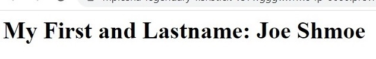

# Task on Terraform: Creating Docker Containers

The task involves writing a `main.tf` Terraform file that provisions two Docker containers. The first container should run an **Nginx** web server, and the second container should run a **MariaDB** database server.
## Nginx Container
The Nginx container is responsible for serving web content. It should be configured to return a response with the following text:
```
My First and Lastname: <Your first and lastname>
```
The screenshot as example:


## MariaDB Container
The MariaDB container should be configured to set the root password that we pass as a Terraform variable named `db_root_password` when running the `terraform apply` command. Here is an example:
```terraform
terraform apply -var="db_root_password=passexample"
```
